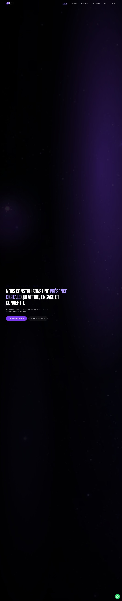
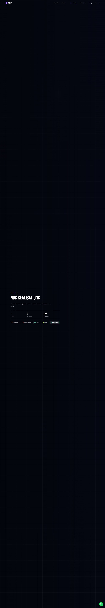
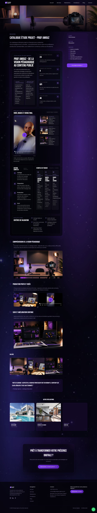
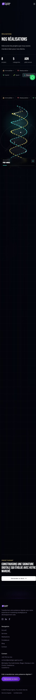

# Audit Premium - Prestigia Agency

Date : 22 août 2026  
Cible auditée : version locale ouverte sur `http://localhost:3002`  
Marché prioritaire : Casablanca / Maroc, avec ouverture internationale

## Verdict exécutif

Prestigia Agency a déjà une identité reconnaissable : noir profond, mauve, ambiance spatiale, ADN, sensation technologique et créative. Il ne faut pas casser cette direction. Il faut la rendre plus premium, plus lisible et plus orientée preuve.

Aujourd'hui, le site donne une bonne impression d'agence créative, mais certaines pages d'entrée sous-vendent l'agence : trop d'espace vide au-dessus du contenu, pas assez de preuves immédiates, quelques titres H1 manquants, et des projets parfois plus riches que la page d'accueil elle-même. La meilleure direction actuelle se trouve déjà dans les pages projet, surtout le catalogue Education : contenu plus dense, narration, chiffres, médias, vision projet. C'est cette maturité qu'il faut remonter dans l'accueil, les services et les réalisations.

Direction recommandée : **Cinematic Violet Intelligence**.  
Un site sombre, premium, technologique, mais avec plus de structure commerciale : promesse claire, preuves visibles, projets mieux scénarisés, services rangés par résultats, et mouvements fluides mais légers.

## Captures d'audit

## A. À garder

- L'ADN visuel Prestigia : noir, mauve, glow, univers spatial, sensation digitale premium.
- La logique de portfolio vivant sur la page Réalisations, surtout l'idée ADN + catégories.
- La typographie actuelle en affichage, car elle donne une signature forte et reconnaissable.
- Les pages projet longues et scénarisées, surtout le format catalogue Education.
- Le ton d'agence créative technologique, pas trop corporate.
- Les données déjà structurées côté projets et catégories, utiles pour l'admin et Supabase.
- Le socle SEO déjà présent : sitemap, robots, JSON-LD, métadonnées sur plusieurs pages, alt images corrects sur les pages inspectées.

## B. À améliorer

### Priorité visuelle

- Réduire les grands espaces vides sur desktop, surtout l'accueil et les réalisations.
- Faire apparaître la proposition de valeur dès le premier écran.
- Remonter les preuves : projets, secteurs, résultats, services, localisation Casablanca.
- Rendre les cartes projet plus proches de l'ADN : compactes, animées, comme si elles sortaient du système.
- Harmoniser les animations pour qu'elles servent le parcours, pas seulement l'ambiance.

### Priorité UX

- Clarifier les actions principales : `Demander un devis`, `Voir nos réalisations`, `Parler d'un projet`.
- Ajouter une promesse autour du formulaire : délai de réponse, type d'audit, ce que le client reçoit.
- Faire de la page Services une page de décision, pas seulement une grille.
- Ajouter des liens internes entre services, projets, blog et devis.
- Prévoir une version réduite des animations sur mobile pour garder la qualité sans lourdeur.

### Priorité SEO

- Corriger les pages sans H1 détecté : `/services`, `/fondateurs`, `/blog`, `/contact`, `/devis`.
- Corriger les titres dupliqués du type `| Prestigia Agency | Prestigia Agency`.
- Ajouter plus de texte indexable orienté intention locale sur les pages clés.
- Créer ou renforcer les pages services autour des mots-clés Casablanca / Maroc.

## C. À ajouter

- Une barre de preuve juste après ou dans le hero : nombre de projets, secteurs, services clés, Casablanca.
- Un bloc "Nos meilleurs cas" sur l'accueil avec 3 projets forts.
- Un mini showreel ou une carte vidéo légère, sans ralentir le site.
- Des sections résultat par projet : objectif, action, contenu produit, indicateurs, apprentissage.
- Des preuves locales : adresse, zone d'intervention, Google Business Profile, avis réels si disponibles.
- Une FAQ SEO sur les pages services.
- Une structure plus claire pour les landing pages locales : Google Ads Maroc, Meta Ads Maroc, production vidéo Casablanca, création contenu Casablanca, agence IA Maroc.
- Un bloc "Méthode Prestigia" : comprendre la vision, filmer, produire, publier, mesurer, améliorer.

## D. À retirer ou réduire

- Les grands vides qui donnent l'impression que le site charge mal ou qu'il manque du contenu.
- Les effets 3D décoratifs qui ne racontent rien ou ralentissent la navigation.
- Les animations trop longues avant d'arriver à la preuve.
- Les statistiques non vérifiées ou trop génériques.
- Les titres trop vagues qui pourraient appartenir à n'importe quelle agence.
- Les répétitions SEO dans les titres de page.

## E. Palette recommandée

Garder le mauve et le noir, mais ajouter plus de contraste, de lumière blanche et quelques accents secondaires pour éviter un site trop mono-couleur.

| Rôle | HEX | RGB | Usage |
|---|---:|---:|---|
| Noir signature | `#05030B` | `5, 3, 11` | Fond principal |
| Aubergine profond | `#120826` | `18, 8, 38` | Dégradés, fonds secondaires |
| Violet Prestigia | `#7C3AED` | `124, 58, 237` | CTA, liens actifs, glow principal |
| Violet électrique | `#A855F7` | `168, 85, 247` | Hover, accents premium |
| Bleu cinéma | `#38BDF8` | `56, 189, 248` | Détails tech, data, ADN secondaire |
| Blanc premium | `#F6F2FF` | `246, 242, 255` | Titres, textes importants |
| Lavande texte | `#BDB4D8` | `189, 180, 216` | Paragraphes |
| Champagne discret | `#D8B86A` | `216, 184, 106` | Tags premium, catégories, preuves |

Règle : le violet doit dominer l'identité, mais pas tout l'écran. Le blanc premium, le noir et le bleu cinéma doivent donner de la profondeur.

## F. Typographie

Comparaison actuelle : la direction typographique est déjà cohérente avec l'identité. Le display condensé donne un effet fort, presque affiche de studio. Il faut surtout régler les tailles, les espacements et la hiérarchie.

Recommandation :

- Garder le display actuel pour les grands titres.
- Garder le body actuel si le rendu reste lisible, sinon tester `Manrope` ou `Geist Sans` pour le texte courant.
- Ne pas changer uniquement pour suivre une tendance.
- H1 desktop : 56 à 92 px selon page, line-height 0.9 à 0.95.
- H1 mobile : 42 à 54 px, line-height 0.9 à 1.
- H2 : 34 à 56 px.
- Texte courant : 16 à 18 px, line-height 1.6 à 1.75.
- Boutons : 14 à 15 px, semi-bold, lisible, pas trop espacé.
- Éviter les textes longs en capitales, surtout sur mobile.

## G. Direction UI

Nom de direction : **Cinematic Violet Intelligence**.

Le site doit sentir : premium, créatif, digital, Casablanca, studio exigeant, technologie maîtrisée. Pas un site "template agence". Pas un site trop expérimental où le client ne comprend pas quoi faire.

Principes UI :

- Fonds sombres cinématiques avec profondeur, mais contenu toujours lisible.
- Grilles fines, lignes ADN, reflets et halos contrôlés.
- Cartes plus serrées, plus précises, avec bordures fines et radius contenu.
- CTA violet solide pour l'action principale, bouton secondaire plus discret.
- Utilisation du blanc pour donner de la valeur au message.
- Photos et vidéos plus présentes, car l'agence vend aussi l'image, la production et la preuve.
- Les animations doivent donner une sensation chère, pas une sensation gadget.

## H. Structure idéale des pages

### Accueil

1. Hero clair : agence marketing digital premium à Casablanca, contenu, acquisition, web et IA.
2. Preuves immédiates : projets, secteurs, formats produits, localisation.
3. 3 cas clients forts avec image ou vidéo.
4. Services regroupés par résultat : attirer, convertir, produire, automatiser.
5. Méthode Prestigia.
6. Showreel ou module vidéo léger.
7. Témoignages ou preuves sociales réelles.
8. Articles / conseils SEO.
9. CTA final vers devis.

### Services

1. H1 SEO clair.
2. Services par objectif business.
3. Pour chaque service : problème, solution, livrables, preuve, CTA.
4. Liens vers projets liés.
5. FAQ locale.

### Réalisations

1. Intro courte.
2. ADN plein écran, mais sans grands vides inutiles.
3. Catégories sticky et cliquables.
4. Cartes projet compactes qui sortent visuellement de l'ADN au scroll.
5. Mode accessible : grille fallback si animation réduite ou mobile faible.
6. CTA projet suivant / devis.

### Page projet

1. Hero projet avec média fort.
2. Problème client.
3. Vision et compréhension du projet.
4. Production : photo, vidéo, contenu, suivi, publication.
5. Exemples de médias.
6. Chiffres : publications, vues, engagement, qualité vidéo, formats.
7. Résultat et apprentissages.
8. CTA.

### Contact / Devis

1. H1 clair.
2. Promesse de réponse.
3. Choix du besoin.
4. Budget ou niveau d'urgence si utile.
5. Coordonnées et WhatsApp.
6. Réassurance : confidentialité, audit, accompagnement.

## I. Animations et microinteractions

- ADN : doit rester un élément signature, mais il doit continuer avec le scroll et ne pas créer de vide.
- Projets : apparition uniquement au scroll, avec effet de sortie de l'ADN, comme une cellule activée.
- Catégories : sticky, cliquables, et capables d'emmener vers les projets correspondants.
- Hover cartes : média vivant, glow fin, icône d'ouverture.
- Boutons : mouvement court, glow léger, feedback immédiat.
- Vidéos : lazy load, format adapté Reels 9:16 quand nécessaire.
- Mobile : animations simplifiées mais nettes, sans pixellisation, sans cartes trop grandes.
- Accessibilité : respecter `prefers-reduced-motion`.
- Performance : privilégier `transform`, `opacity`, images optimisées, vidéos compressées, WebGL uniquement si nécessaire.

## J. Plan SEO Google

### Technique

- Vérifier H1 unique sur chaque page.
- Corriger les titres dupliqués.
- Garder sitemap et robots propres.
- Ajouter ou vérifier schema : `LocalBusiness`, `Organization`, `Service`, `FAQPage`, `BreadcrumbList`, `CreativeWork` ou `Project`.
- Optimiser images et vidéos pour Core Web Vitals.
- Ajouter des textes alternatifs descriptifs pour les nouveaux médias.
- Prévoir des pages rapides sur mobile.

### Contenu local

Créer ou renforcer des sections/pages pour :

- agence marketing digital Casablanca
- agence digitale Casablanca
- agence communication digitale Casablanca
- agence création contenu Casablanca
- production vidéo Casablanca
- agence création site web Casablanca
- agence Meta Ads Maroc
- agence Google Ads Maroc
- agence publicité en ligne Maroc
- agence IA Maroc
- agence SEO Casablanca / Maroc

### Structure de contenu

- Chaque service doit lier vers au moins un projet.
- Chaque projet doit lier vers les services utilisés.
- Le blog doit soutenir les pages services.
- Les pages projet doivent inclure des résultats mesurables quand disponibles.
- Ajouter des FAQ courtes sur les pages business.

### Local SEO

- Afficher clairement Casablanca et Maroc.
- Ajouter coordonnées cohérentes avec Google Business Profile.
- Intégrer avis réels si disponibles.
- Créer des pages ou sections par service local, sans bourrage de mots-clés.

### IA / GEO

- Ajouter des blocs de réponse clairs : "Prestigia Agency accompagne qui ?", "Quels services ?", "Quels résultats ?".
- Structurer les pages pour être citées par les moteurs IA.
- Ajouter éventuellement `llms.txt` plus tard.

## K. Priorités

### P0 - Impact immédiat

- Réduire les grands espaces vides sur accueil et réalisations.
- Corriger les H1 manquants.
- Corriger les titres SEO dupliqués.
- Renforcer la promesse du hero avec Casablanca, premium, contenus, acquisition, web, IA.
- Ajouter 3 preuves visibles très tôt.
- Rendre le CTA devis plus évident.

### P1 - Conversion et crédibilité

- Recomposer la page Services autour des résultats.
- Ajouter une barre de preuves et clients/secteurs.
- Améliorer les cartes projet et leur densité mobile.
- Ajouter FAQ et liens internes par service.
- Ajouter des indicateurs réels dans les pages projet.

### P2 - Finition premium

- Peaufiner les microinteractions.
- Ajuster la palette pour plus de contraste.
- Optimiser les vidéos et formats Reels.
- Ajouter les pages SEO secondaires.
- Préparer une stratégie GEO / IA.

## Benchmark

| Référence | Ce qui marche | À adapter pour Prestigia | À ne pas copier |
|---|---|---|---|
| BASIC/DEPT | Reel, preuve par les engagements, grands clients, travail mis en avant | Un showreel court et des cas visibles très tôt | Le ton très monochrome et froid |
| AKQA | Positionnement futur, technologie, imagination | Une promesse plus ambitieuse autour de la créativité et de l'IA | Les messages trop abstraits |
| Instrument | Clarté services, clients, reconnaissance | Preuve immédiate et structure services solide | Le style trop international si les preuves locales manquent |
| Huge | Positionnement AI-native, architecture de services claire | Structurer Prestigia autour contenu, acquisition, web, IA | Une expérience trop complexe ou trop corporate |
| Stink Studios | Message simple : stratégie + production en interne | Valoriser la capacité à comprendre, filmer, produire, publier | Le minimalisme trop sec |
| Hello Monday | Portfolio comme expérience principale, filtres et catégories | Réalisations plus vivantes avec catégories ADN | Le ton trop ludique |
| COLLINS | Positionnement premium sur la valeur | Parler de valeur créée, pas seulement de livrables | Les awards si Prestigia ne les possède pas |
| R/GA | Brand systems, innovation, intelligence age | Créer une narration "agence créative + intelligence" | Le vocabulaire trop corporate |
| Active Theory | Immersion digitale, WebGL, expérience mémorable | Garder une couche immersive légère | Sacrifier performance et SEO |
| Resn | Expérimentation créative | Une signature interactive forte | Rendre le site opaque ou dépendant du JS |
| Monogrid | 3D, installations digitales, expériences visuelles | Une scène légère et maîtrisée | Masquer le contenu derrière l'effet |
| Further / ex-DesignStudio | Discours fort sur créativité et IA | Un manifeste plus net sur l'avenir du marketing | Une promesse trop conceptuelle |
| Awwwards agencies | Niveau d'exécution et détails de motion | Polish, rythme, microinteractions | Chasser les effets d'awards sans conversion |
| Framer agency examples | Storytelling visuel, expertise claire, contact simple | Vérifier chaque page avec une logique conversion | Faire un site vitrine sans preuve business |
| Concurrents Maroc | Mots-clés locaux et pages services très ciblées | Renforcer Casablanca / Maroc dans l'architecture SEO | Devenir une agence générique "top agence web" |

Top 5 références à garder comme boussole :

1. AKQA pour l'ambition technologique.
2. BASIC/DEPT pour la preuve par le travail et le reel.
3. Instrument pour la clarté services + crédibilité.
4. Huge pour l'angle AI-native.
5. COLLINS pour la sensation premium et la notion de valeur.

## Validation mots-clés

Recherche qualitative faite sur les intentions Google et les concurrents visibles. Pour le volume exact, il faudra Google Keyword Planner, Search Console ou Semrush/Ahrefs.

### Mots-clés P0

- agence marketing digital Casablanca
- agence digitale Casablanca
- agence communication digitale Casablanca
- agence création site web Casablanca
- agence création contenu Casablanca
- production vidéo Casablanca

### Mots-clés P1

- agence Google Ads Maroc
- agence Meta Ads Maroc
- agence publicité en ligne Maroc
- agence SEO Maroc
- agence SEO Casablanca
- agence IA Maroc
- community management Casablanca

### Mots-clés P2

- agence branding Casablanca
- shooting photo professionnel Casablanca
- vidéo corporate Casablanca
- automatisation WhatsApp CRM leads Maroc
- GEO / Generative Engine Optimization Maroc

## Sources benchmark et SEO consultées

- [Awwwards - Design Agencies](https://www.awwwards.com/websites/design-agencies/)
- [Awwwards - Inspiration Search Design Agencies](https://www.awwwards.com/inspiration_search/design-agencies/)
- [BASIC/DEPT](https://www.basicagency.com/)
- [AKQA](https://www.akqa.com/)
- [Instrument](https://www.instrument.com/)
- [Huge](https://www.hugeinc.com/)
- [Stink Studios](https://www.stinkstudios.com/)
- [Hello Monday](https://www.hellomonday.com/)
- [COLLINS](https://wearecollins.com/)
- [R/GA](https://www.rga.com/)
- [Further, ex-DesignStudio](https://www.design.studio/)
- [Framer - Marketing agency websites](https://www.framer.com/blog/marketing-agency-websites/)
- [Colorlib - Agency website examples](https://colorlib.com/wp/agency-websites/)
- [Rhillane Marketing Digital Maroc](https://rhillane.com/)
- [DigitalMa](https://digitalma.ma/)
- [VOID - Agence Marketing Digital Maroc](https://void.ma/services/agence-marketing-digital-maroc/)
- [BuildLab - Publicité en ligne Maroc](https://buildlabmedia.com/publicite-en-ligne/)
- [ARPictures - Production vidéo Maroc](https://arpictures.ma/)

## Note de limite

Cet audit s'appuie sur la version locale ouverte dans le navigateur et sur une recherche web qualitative. Il ne remplace pas encore un audit Search Console, GA4, Keyword Planner, PageSpeed field data ou heatmaps réelles. La prochaine étape logique est de transformer les P0 en maquettes puis en changements concrets sur le site.
